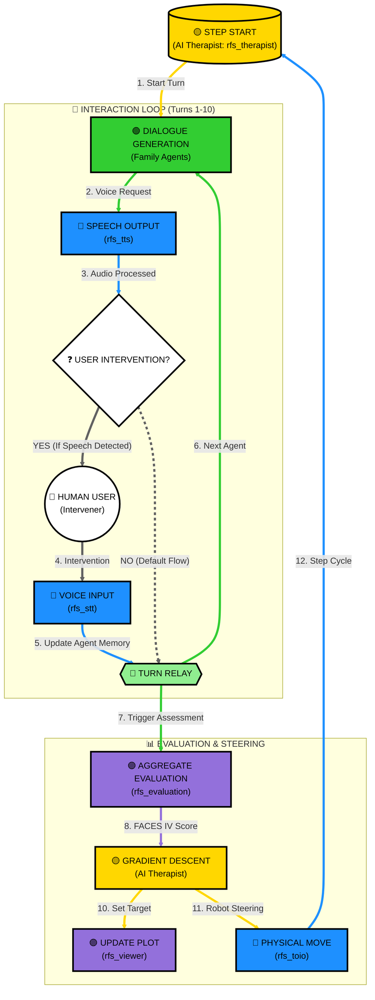

[**English**](README.md) | [**日本語**](README.ja.md)

# RFS: Robot Family System (ロボット家族システム)

RFS (Robot Family System) は、家族療法および家族心理学のためのROS2ベースの研究・教育用シミュレーションプラットフォームです。複数のLLMベースのエージェントを活用して複雑な家族のダイナミクスをシミュレートし、FACES IV 円環モデル上で心理状態を可視化し、勾配降下法（Gradient Descent）を用いてAI主導の治療介入を提案します。

このプロジェクトは、筑波大学 **田中文英研究室** の研究の一部として開発されています。当研究室では、ヒューマンロボットインタラクション、社会心理学、および高度なAIの交差点に焦点を当て、人間のウェルビーイングと社会的調和を向上させるシステムの設計を行っています。

🔗 **研究室の詳細についてはこちら**: [田中文英研究室 - プロジェクト](https://www.ftl.iit.tsukuba.ac.jp/projects/)

## 🌟 主な機能

- **マルチエージェントシミュレーション**: 高度なLLMを使用して、家族メンバーそれぞれの個性（父、母、娘、息子）をシミュレートします。
- **FACES IV 可視化**: 家族のダイナミクスを「親密度（Cohesion）」と「柔軟性（Flexibility）」の軸上にリアルタイムでマッピングします。
- **デュアル軌跡トラッキング**: 「実際の家族の状態」と「治療目標」の両方を同じプロット上に可視化します。
- **予測的インタラクション**: 「背景シナリオ生成」を実装し、エージェントの応答を事前生成することで、遅延を大幅に削減します。
- **物理表現**: [toio™](https://toio.io/) ロボットとの連携により、対人距離を物理的に表現します。
- **インタラクティブ音声**: リアルタイム音声認識（STT）と、音声合成（TTS）により、人間による介入が可能です。

## 🏗 システムアーキテクチャと処理フロー

システムは、**AI Therapist** (`rfs_therapist`) がOlsonの円環モデルに基づいて家族メンバーを健康的でバランスの取れた状態へと誘導するクローズドループ・サイクルで動作します。**人間（ユーザー）** はオプションで家族の対話に介入し、シミュレーションに影響を与えることができます。



### ノードごとの詳細な役割

| ノード | 役割 | 主な機能 |
| :--- | :--- | :--- |
| **`rfs_therapist`** | 治療的介入の制御 | 勾配降下法を用いて、バランス・タイプへの遷移を促進します。 |
| **`rfs_family`** | 家族メンバー | LLMを使用して家族の個性（父、母など）をシミュレートします。 |
| **`rfs_stt`** | 音声入力 | Gemini Liveを介した人間介入のためのリアルタイム音声認識。 |
| **`rfs_tts`** | 音声出力 | 家族の対話のためのマルチシンク同期音声合成。 |
| **`rfs_toio`** | 物理レイヤー | [toio™](https://toio.io/) ロボットを使用した対人距離の表現。 |
| **`rfs_viewer`** | 可視化 | 心理的軌跡をプロットするためのリアルタイムGUI。 |
| **`rfs_evaluation`** | マッピングと評価 | ログを集計し、FACES IV 円環モデルにマッピングします。 |

## 🚀 はじめに

### 前提条件
- **OS**: Ubuntu 24.04 (Noble Numbat)
- **ROS2**: [Jazzy Jalisco](https://docs.ros.org/en/jazzy/Installation.html)
- **Hardware**: [toio™](https://toio.io/) コア キューブ (オプション)。

### 必要ライブラリ (Requirements)

プロジェクトをビルドする前に、必要なシステムライブラリと Python ライブラリがインストールされていることを確認してください。

**1. システム依存関係**
```bash
sudo apt update && sudo apt install -y python3-tk libportaudio2
```

**2. Python ライブラリ**
```bash
pip install openai google-genai numpy sounddevice webrtcvad matplotlib toio-py Pillow
```

### インストール

1. **クローンとビルド**:
   ```bash
   git clone https://github.com/robotaichi/rfs.git
   cd rfs
   colcon build
   source install/setup.bash
   ```

### 設定 (Configuration)

シミュレーションを起動する前に、有効なAPIキーを設定する必要があります。設定を永続化するには、`~/.bashrc` に追記してください：

```bash
# 1. .bashrc を開く
nano ~/.bashrc

# 2. ファイルの末尾に以下を追記して保存
export OPENAI_API_KEY="sk-..."
export GEMINI_API_KEY="AIza..."

# 3. 設定を反映
source ~/.bashrc
```

- [**`OPENAI_API_KEY`**](https://platform.openai.com/api-keys): LLMベースの対話生成および心理マッピングに不可欠です。
- [**`GEMINI_API_KEY`**](https://aistudio.google.com/app/apikey): Gemini Liveベースの音声書き起こしに必要です。

2. **起動**:
   ```bash
   ros2 launch rfs_bringup rfs_all.launch.py
   ```

## ⚙️ 設定 (Settings)

### `config.json` 仕様
`src/rfs_config/config/config.json` に配置されています。

| パラメータ | 型 | デフォルト | 説明 |
| :--- | :--- | :--- | :--- |
| **`language`** | String | `"en"` | インタラクション言語: `"en"` (英語) または `"ja"` (日本語)。 |
| **`theme`** | String | N/A | 家族の会話のハイレベルなトピック。 |
| **`chat_mode`** | Integer | `0` | `0` (通常), `1` (ターミナルモード - ハードウェアなし)。 |
| **`toio_move`** | Integer | `1` | toioの移動を有効化: `1` (有効), `0` (無効)。 |
| **`target_user`** | String | `"User"` | 家族と対話するユーザーの名前。 |
| **`family_config`** | List | `["father", "mother", "daughter"]` | シミュレーションでアクティブな家族の役割。 |
| **`toio_speaker_match`** | List | `[...]` | ハードウェア（toio）とスピーカーの対応付け設定。 |
| **`learning_rate_scaling`** | Float | `0.25` | 治療的誘導の基本感度。 |
| **`w1`, `w2`, `w3`** | Float | `1.0, 1.0, 0.5` | 親密度、柔軟性、およびコミュニケーションの重み。 |
| **`turns_per_step`** | Integer | `10` | 評価トリガーの頻度 (単位: **ターン**)。 |
| **`vad_aggressiveness`** | Integer | `3` | VAD（音声活動検知）の感度 (範囲: 0-3)。 |
| **`silence_duration_s`** | Float | `2.0` | 発話終了とみなす無音時間 (単位: **秒**)。 |
| **`speech_trigger_frames`** | Integer | `5` | 録音開始に必要なフレーム数 (30ms/フレーム)。 |
| **`vad_debug`** | Boolean | `false` | 診断用の詳細な VAD ログを有効化。 |
| **`vad_energy_threshold`** | Float | `2000.0` | 発話検知のための最小 RMS エネルギーレベル。 |
| **`llm_model`** | String | `"gpt-4o"` | 家族の対話生成に使用するモデル。 |
| **`llm_temperature`** | Float | `1.0` | 対話の創造性係数。 |
| **`llm_evaluation_model`** | String | `"gpt-4o"` | FACES IV 自己評価に使用するモデル。 |
| **`llm_evaluation_temperature`** | Float | `0.7` | 評価の安定性係数。 |
| **`initial_coords`** | Object | `{"x": 8, "y": 8}` | 開始座標 (スケール: **0-100 パーセンタイル**)。 |
| **`experiment`** | String | `""` | 試行/実験ラベル用のオプションタグ。 |
| **`terminal_mode`** | String | `"gnome-terminal"` | ノードの起動に使用するターミナル。 |
| **`shutdown_timer_minutes`** | Integer | `0` | 自動シャットダウンタイマー (単位: **分**)。 |

### LLM の選択とガイダンス
- **デフォルトモデル (`gpt-4o`)**: 優れた推論能力と人間社会の力学に対する深い理解から、`gpt-4o` を標準として採用しています。この研究に必要な複雑な心理学的役割を効果的にシミュレートします。
- **温度（Temperature） 設定**:
  - **対話 (`1.0`)**: 家族の相互作用の動的な性質を反映し、自然で多様かつ創造的な会話を保証するために、より高い温度が使用されます。
  - **評価 (`0.7`)**: 心理的評価において、信頼性と一貫性を保ちつつ、シミュレートされたメンバーの「主観的な感覚」を捉えるために、やや低い温度が使用されます。

## 📊 FACES IV モデルと勾配降下法

システムは、治療的介入を最適化問題として扱います。家族の状態が「遊離（Disengaged）」または「密着（Enmeshed）」と特定された場合、**AI Therapist** は **勾配降下法（Gradient Descent）** を使用して健康な状態への最適なパスを計算します。

### パーセンタイル変換

数学的な処理やプロットの前に、システムは評価から得られた **Raw Scores（生得点）** を **Percentile Scores（パーセンタイル順位）** に変換します。この変換は、円環モデル上への標準化されたマッピングに不可欠であり、勾配降下法が正規化されたスケール（$0$ から $100$）で動作することを保証します。

システムでは、標準的な FACES IV 基準に基づいた以下の変換チャートを使用しています。

#### 1. バランス尺度およびアンバランス尺度 (親密度と柔軟性)

| Raw Score | Balanced Percentile (C/F) | Unbalanced Percentile (D/E/R/C) |
| :--- | :--- | :--- |
| **7** | 16 | 10 |
| **8** | 18 | 12 |
| **9** | 20 | 13 |
| **10** | 22 | 14 |
| **11** | 24 | 15 |
| **12** | 25 | 16 |
| **13** | 26 | 18 |
| **14** | 27 | 20 |
| **15** | 28 | 24 |
| **16** | 30 | 26 |
| **17** | 32 | 30 |
| **18** | 35 | 32 |
| **19** | 36 | 34 |
| **20** | 38 | 36 |
| **21** | 40 | 40 |
| **22** | 45 | 45 |
| **23** | 50 | 50 |
| **24** | 55 | 55 |
| **25** | 58 | 60 |
| **26** | 60 | 64 |
| **27** | 62 | 68 |
| **28** | 65 | 70 |
| **29** | 68 | 75 |
| **30** | 70 | 80 |
| **31** | 75 | 85 |
| **32** | 80 | 90 |
| **33** | 82 | 95 |
| **34** | 84 | 98 |
| **35** | 85 | 99 |

#### 2. 家族コミュニケーション

| Raw Score | Percentile || Raw Score | Percentile |
| :--- | :--- | :--- | :--- | :--- |
| **10-23** | 10 || **37** | 58 |
| **24** | 12 || **38** | 62 |
| **25** | 13 || **39** | 65 |
| **26** | 14 || **40** | 70 |
| **27** | 15 || **41** | 74 |
| **28** | 18 || **42** | 80 |
| **29** | 21 || **43** | 83 |
| **30** | 24 || **44** | 86 |
| **31** | 28 || **45** | 88 |
| **32** | 32 || **46** | 90 |
| **33** | 36 || **47** | 94 |
| **34** | 40 || **48** | 96 |
| **35** | 44 || **49** | 97 |
| **36** | 50 || **50** | 99 |

### 比率スコア (Ratio Scores)

システムは、家族システムの全体的な健康状態を評価するために **比率スコア** も計算します。比率スコアが 1 より大きい場合は通常、健康的でバランスの取れたシステムであることを示し、1 未満の場合はアンバランスな（不健康な）システムであることを示唆します。

これらは変換された **パーセンタイル順位** を使用して計算されます。

1. **親密度比率 (Cohesion Ratio)**
> [!NOTE]
> ```math
> \text{Cohesion Ratio} = \frac{C_{bal}}{(C_{dis} + C_{enm}) / 2}
> ```

2. **柔軟性比率 (Flexibility Ratio)**
> [!NOTE]
> ```math
> \text{Flexibility Ratio} = \frac{F_{bal}}{(F_{rig} + F_{cha}) / 2}
> ```

3. **トータル比率 (Total Ratio)**
> [!NOTE]
> ```math
> \text{Total Ratio} = \frac{\text{Cohesion Ratio} + \text{Flexibility Ratio}}{2}
> ```

### 数学的基盤

AI Therapist は、家族の状態ベクトルに対して勾配降下法を行い、最適な治療パスを計算します。

#### 1. 状態ベクトル ($x_t$)
ターン $t$ における家族の状態は、変換された **パーセンタイル順位** からなる 7 次元のベクトルとして表されます。

> [!NOTE]
> ```math
> x_t = \begin{bmatrix} C_{bal} \\ C_{dis} \\ C_{enm} \\ F_{bal} \\ F_{rig} \\ F_{cha} \\ Comm \end{bmatrix} = [C_{bal}, \dots, Comm]^T
> ```

#### 2. 目的関数 ($J(x_t)$)
目標は、FACES IV比率（健康）とセンタリング（安定性）のバランスをとるコスト関数を最小化することです。

> [!NOTE]
> ```math
> J(x_t) = \omega_1 \frac{U}{2B} - \omega_2 Comm_t + \frac{\omega_3}{2} \left[ (x - 50)^2 + (y - 50)^2 \right]
> ```
ここで:
- $B = C_{bal} + F_{bal}$ (バランス尺度の和)
- $U = C_{dis} + C_{enm} + F_{rig} + F_{cha}$ (アンバランス尺度の和)

> [!NOTE]
> ```math
> x = C_{bal} + \frac{C_{enm} - C_{dis}}{2}, \quad y = F_{bal} + \frac{F_{cha} - F_{rig}}{2}
> ```

#### 3. 勾配計算 ($\nabla J(x_t)$)
勾配ベクトル $\nabla J(x_t)$ は、コスト関数が最も急激に増加する方向を表します。

> [!NOTE]
> ```math
> \nabla J(x_t) = \left[ \frac{\partial J}{\partial C_{bal}}, \dots, \frac{\partial J}{\partial Comm} \right]^T
> ```

個々の偏導関数は次のように計算されます（比率項とセンタリング項を組み合わせています）。

> [!NOTE]
> ```math
> \begin{aligned}
> \frac{\partial J}{\partial C_{bal}} &= - \frac{\omega_1 U}{2B^2} + \omega_3(x - 50) \\
> \frac{\partial J}{\partial F_{bal}} &= - \frac{\omega_1 U}{2B^2} + \omega_3(y - 50) \\
> \frac{\partial J}{\partial C_{enm}} &= \frac{\omega_1}{2B} + \frac{\omega_3}{2}(x - 50) \\
> \frac{\partial J}{\partial C_{dis}} &= \frac{\omega_1}{2B} - \frac{\omega_3}{2}(x - 50) \\
> \frac{\partial J}{\partial F_{cha}} &= \frac{\omega_1}{2B} + \frac{\omega_3}{2}(y - 50) \\
> \frac{\partial J}{\partial F_{rig}} &= \frac{\omega_1}{2B} - \frac{\omega_3}{2}(y - 50) \\
> \frac{\partial J}{\partial Comm} &= - \omega_2
> \end{aligned}
> ```

#### 4. 更新ルールと適応的学習率
ターゲット状態は反復的に更新されます。

> [!NOTE]
> ```math
> x_{t+1} = x_t - \eta(Comm_t) \cdot \nabla J(x_t)
> ```

ここで、適応的学習率 $\eta (Comm_t)$ は **ステップ幅** を表します。

> [!NOTE]
> ```math
> \eta(Comm_t) = \frac{Comm_t}{100} \cdot 0.25
> ```

**0.25** は、治療的誘導の全体的な感度を決定する基本スケーリング係数（`config.json` の `learning_rate_scaling` で設定可能）です。

*このステップ幅は、コミュニケーション次元とともに、親密度と柔軟性を促進するための **駆動力** として機能します。*

得られたベクトルによって、個々の家族メンバーに対する **行動誘導プロンプト（Behavioral Steering Prompts）** が調整され、システムを **バランスの取れた中心 (50, 50)** へと引き寄せます。

## 📚 参考文献
- **Olson's Circumplex Model**: [Circumplex Model: An Update (Prepare/Enrich)](https://www.prepare-enrich.com/wp-content/uploads/2022/08/Circumplex-Model-An-Update.pdf)
- **FACES IV Manual**: [FACES IV: Manual de Aplicación de Instrumento](https://www.studocu.com/cl/document/universidad-de-valparaiso/trabajo-social-de-familia/faces-iv-manual-aplicacion-de-instrumento/107365427)

## 📜 ライセンス
このプロジェクトは MIT ライセンスの下で提供されています。
