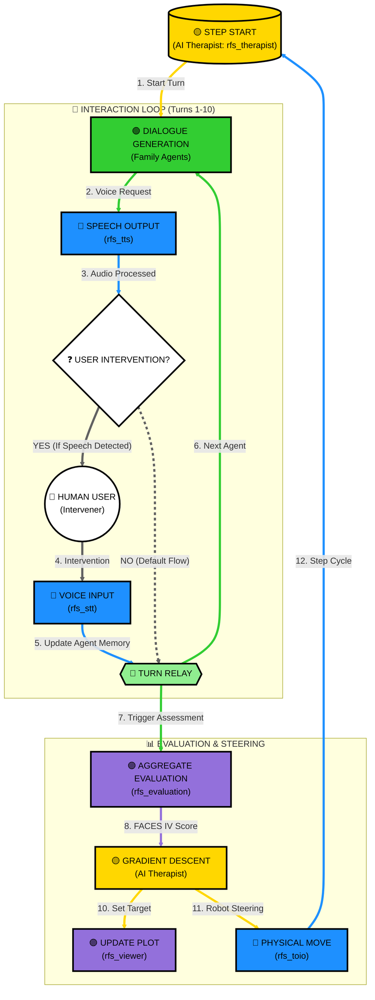

# RFS: Robot Family System

RFS (Robot Family System) is a ROS2-based research and educational simulation platform for family therapy and family psychology. It leverages Multiple LLM-based agents to simulate complex family dynamics, visualizes psychological states on the FACES IV circumplex model, and uses Gradient Descent to suggest AI-driven therapeutic interventions.

This project is developed as part of the research at the **Fumihide Tanaka Laboratory** at the University of Tsukuba. Our research focuses on the intersection of human-robot interaction, social psychology, and advanced AI to design systems that enhance human well-being and social harmony.

🔗 **Learn more about our research**: [Fumihide Tanaka Laboratory - Projects](https://www.ftl.iit.tsukuba.ac.jp/projects/)

## 🌟 Key Features

- **Multi-Agent Simulation**: Simulates distinct family member personalities (Father, Mother, Daughter, Son) using advanced LLMs.
- **FACES IV Visualization**: Real-time mapping of family dynamics onto Cohesion and Flexibility axes.
- **Dual Trajectory Tracking**: Visualizes both the "Actual Family State" and the "Therapeutic Target" on the same plot.
- **Predictive Interaction**: Implements "Background Scenario Generation" to pre-generate agent responses, significantly reducing latency.
- **Physical Representation**: Integration with [toio™](https://toio.io/) robots for tangible representation of interpersonal distances.
- **Interactive Audio**: Real-time Speech-to-Text (STT) and Text-to-Speech (TTS) capabilities for optional human intervention.

## 🏗 System Architecture & Processing Flow

The system operates in a closed-loop cycle where the **AI Therapist** (`rfs_therapist`) orchestrates agents. The **Human User** can optionally intervene in the family dialogue to influence the simulation.



### Detailed Node Responsibilities

| Node Category | Description | Primary Processing |
| :--- | :--- | :--- |
| **AI Therapist / Orchestrator** (`rfs_therapist`) | The system brain. Manages step-level logic and interventions. | Aggregate member evaluations, calculate Cohesion/Flexibility percentiles, and perform Gradient Descent toward balanced center (50, 50). |
| **Agents** (`rfs_family`) | Individual nodes for each family role (Father, Mother, etc.). | LLM-based response generation, turn-taking logic, and individual FACES IV self-scoring. |
| **Sensory/Motor** (`rfs_stt`, `rfs_tts`, `rfs_toio`) | The physical/audio interface layers. | GEMINI-based speech recognition, multi-sink synchronized audio output, and Bluetooth BLE control for toio robots. |
| **Visualization** (`rfs_viewer`, `rfs_evaluation`) | Real-time monitoring and mapping. | Tkinter-based GUI for plotting the circumplex model and background processing of psychological metrics. |

## ⚙️ Configuration & Environment

### Environment Variables
The system requires valid API keys for LLM and STT functionalities.

- **`OPENAI_API_KEY`**: Used by `rfs_family` for personality simulation and `rfs_evaluation` for mapping family dynamics.
- **`GEMINI_API_KEY`**: Used by `rfs_stt` for high-performance audio transcription and real-time interaction.

### `config.json` Specification
Located in `src/rfs_config/config/config.json`.

| Parameter | Type | Description |
| :--- | :--- | :--- |
| **`language`** | String | Language code for interaction: `"en"` (English) or `"ja"` (Japanese). |
| **`theme`** | String | The scenario or topic of conversation (e.g., "Christmas", "Moving Out"). |
| **`w1`, `w2`, `w3`** | Float | Weights for the FACES IV evaluation model (Cohesion, Flexibility, Communication). |
| **`turns_per_step`** | Integer | Number of conversation turns before an evaluation trigger. |
| **`toio_speaker_match`** | List | Hardware mapping for robots (`toio_id`) and audio outputs (`speaker_id`). |

## 🚀 Getting Started

### Prerequisites
- **OS**: Ubuntu 24.04 (Noble Numbat)
- **ROS2**: [Jazzy Jalisco](https://docs.ros.org/en/jazzy/Installation.html)
- **Hardware**: toio™ Core Cubes (Optional).

### Installation
1. **Clone & Build**:
   ```bash
   git clone https://github.com/robotaichi/rfs.git
   cd rfs
   colcon build
   source install/setup.bash
   ```

2. **Launch**:
   ```bash
   ros2 launch rfs_bringup rfs_all.launch.py
   ```

## 📊 FACES IV Model & Gradient Descent

The system treats therapeutic intervention as an optimization problem. If a family state is identified as "Disengaged" or "Enmeshed", the **AI Therapist** calculates the optimal path toward health using **Gradient Descent**.

### Percentile Conversion

Before any mathematical processing or plotting, the system converts the **Raw Scores** obtained from assessments into **Percentile Scores**. This conversion is essential for standardized mapping onto the Circumplex Model and ensures that the Gradient Descent operates on a normalized scale ($0$ to $100$).

The following conversion charts, based on standard FACES IV norms, are used by the system.

#### 1. Balanced & Unbalanced Scales (Cohesion & Flexibility)

| Raw Score | Balanced Pct (C/F) | Unbalanced Pct (D/E/R/C) |
| :--- | :--- | :--- |
| **7** | 16 | 10 |
| **8** | 18 | 12 |
| **9** | 20 | 13 |
| **10** | 22 | 14 |
| **11** | 24 | 15 |
| **12** | 25 | 16 |
| **13** | 26 | 18 |
| **14** | 27 | 20 |
| **15** | 28 | 24 |
| **16** | 30 | 26 |
| **17** | 32 | 30 |
| **18** | 35 | 32 |
| **19** | 36 | 34 |
| **20** | 38 | 36 |
| **21** | 40 | 40 |
| **22** | 45 | 45 |
| **23** | 50 | 50 |
| **24** | 55 | 55 |
| **25** | 58 | 60 |
| **26** | 60 | 64 |
| **27** | 62 | 68 |
| **28** | 65 | 70 |
| **29** | 68 | 75 |
| **30** | 70 | 80 |
| **31** | 75 | 85 |
| **32** | 80 | 90 |
| **33** | 82 | 95 |
| **34** | 84 | 98 |
| **35** | 85 | 99 |

#### 2. Family Communication

| Raw Score | Percentile | Raw Score | Percentile |
| :--- | :--- | :--- | :--- |
| **10-23** | 10 | **37** | 58 |
| **24** | 12 | **38** | 62 |
| **25** | 13 | **39** | 65 |
| **26** | 14 | **40** | 70 |
| **27** | 15 | **41** | 74 |
| **28** | 18 | **42** | 80 |
| **29** | 21 | **43** | 83 |
| **30** | 24 | **44** | 86 |
| **31** | 28 | **45** | 88 |
| **32** | 32 | **46** | 90 |
| **33** | 36 | **47** | 94 |
| **34** | 40 | **48** | 96 |
| **35** | 44 | **49** | 97 |
| **36** | 50 | **50** | 99 |

### Ratio Scores

The system also calculates **Ratio Scores** to assess the overall health of the family system. A Ratio Score greater than 1 typically indicates a healthy, balanced system, while a score less than 1 suggests an unbalanced (unhealthy) system.

These are calculated using the converted **Percentile Scores**:

1. **Cohesion Ratio**

| $\displaystyle \Large \text{Cohesion Ratio} = \frac{c_{bal}}{(c_{dis} + c_{enm}) / 2}$ |
| :--- |

2. **Flexibility Ratio**

| $\displaystyle \Large \text{Flexibility Ratio} = \frac{f_{bal}}{(f_{rig} + f_{cha}) / 2}$ |
| :--- |

3. **Total Ratio**

| $\displaystyle \Large \text{Total Ratio} = \frac{\text{Cohesion Ratio} + \text{Flexibility Ratio}}{2}$ |
| :--- |

### Mathematical Foundation

The AI Therapist calculates the optimal therapeutic path using Gradient Descent on the family state vector.

#### 1. State Vector ($x_t$)
The family state at turn $t$ is represented as a 7-dimensional vector consisting of the converted **Percentile Scores**:

| $\displaystyle \Large x_t = \begin{bmatrix} C_{bal} \\ C_{dis} \\ C_{enm} \\ F_{bal} \\ F_{rig} \\ F_{cha} \\ Comm \end{bmatrix} = [C_{bal}, \dots, Comm]^T$ |
| :--- |

#### 2. Objective Function ($J(x_t)$)
The goal is to minimize a cost function that balances the FACES IV Ratio (Health) and Centering (Stability):

| $\displaystyle \Large J(x_t) = \omega_1 \frac{U}{2B} - \omega_2 Comm_t + \frac{\omega_3}{2} \left[ (x - 50)^2 + (y - 50)^2 \right]$ |
| :--- |
Where:
- $B = C_{bal} + F_{bal}$ (Balanced Sum)
- $U = C_{dis} + C_{enm} + F_{rig} + F_{cha}$ (Unbalanced Sum)

| $\displaystyle \Large x = C_{bal} + \frac{C_{enm} - C_{dis}}{2}, \quad y = F_{bal} + \frac{F_{cha} - F_{rig}}{2}$ |
| :--- |

#### 3. Gradient Calculation ($\nabla J(x_t)$)
The gradient vector $\nabla J(x_t)$ represents the direction of steepest increase for the cost function:

| $\displaystyle \Large \nabla J(x_t) = \left[ \frac{\partial J}{\partial C_{bal}}, \dots, \frac{\partial J}{\partial Comm} \right]^T$ |
| :--- |

Individual partial derivatives are calculated as follows (combining the Ratio and Centering terms):
- $\frac{\partial J}{\partial C_{bal}} = \frac{\partial J}{\partial F_{bal}} = - \frac{\omega_1 U}{2B^2} + \text{Centering Term}$
- $\frac{\partial J}{\partial C_{enm}} = \frac{\partial J}{\partial C_{dis}} = \frac{\partial J}{\partial F_{cha}} = \frac{\partial J}{\partial F_{rig}} = \frac{\omega_1}{2B} + \text{Centering Term}$
- $\frac{\partial J}{\partial Comm} = - \omega_2$

#### 4. Update Rule & Adaptive Learning Rate
The target state is updated iteratively:

| $\displaystyle \Large x_{t+1} = x_t - \eta(Comm_t) \cdot \nabla J(x_t)$ |
| :--- |

Where the adaptive learning rate $\eta (Comm_t)$ represents the **step width**:

| $\displaystyle \Large \eta(Comm_t) = \frac{Comm_t}{100} \cdot 0.25$ |
| :--- |

*(Note: 1 step ($t$) corresponds to 10 conversation turns in the simulation cycle)*

The resulting vector adjusts the **Behavioral Steering Prompts** for individual family members, pulling the system towards the **Balanced Center (50, 50)**.

## 📚 References
- **Olson's Circumplex Model**: [Circumplex Model: An Update (Prepare/Enrich)](https://www.prepare-enrich.com/wp-content/uploads/2022/08/Circumplex-Model-An-Update.pdf)
- **FACES IV Manual**: [FACES IV: Manual de Aplicación de Instrumento](https://www.studocu.com/cl/document/universidad-de-valparaiso/trabajo-social-de-familia/faces-iv-manual-aplicacion-de-instrumento/107365427)

## 📜 License
This project is licensed under the MIT License.
