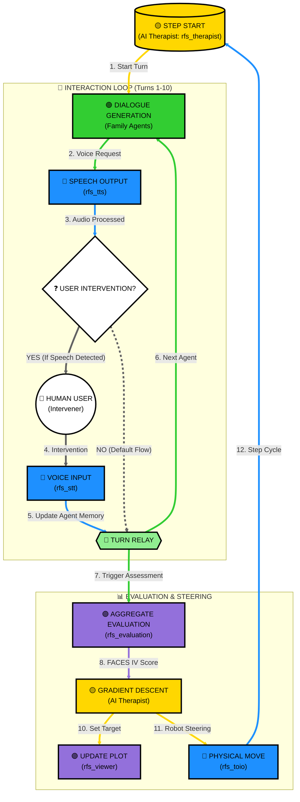
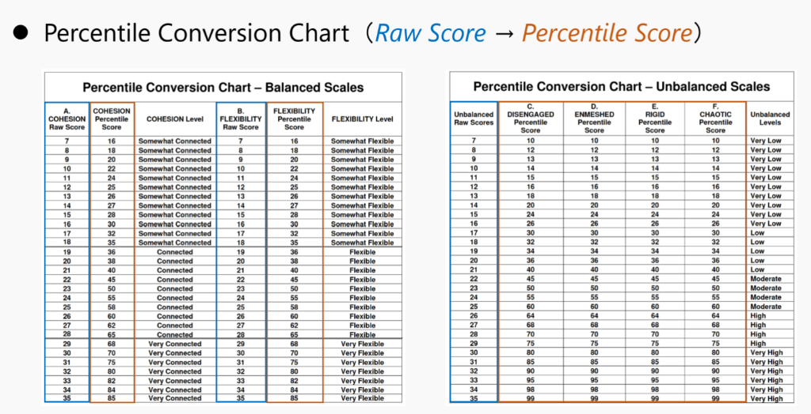
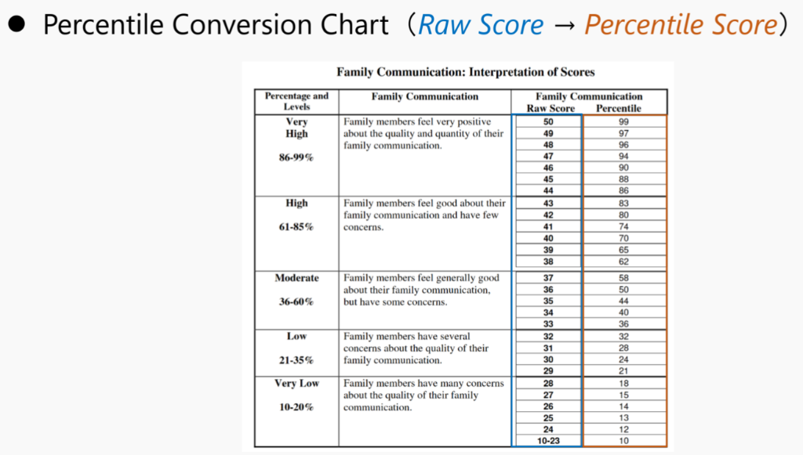

# RFS: Robot Family System

RFS (Robot Family System) is a ROS2-based research and educational simulation platform for family therapy and family psychology. It leverages Multiple LLM-based agents to simulate complex family dynamics, visualizes psychological states on the FACES IV circumplex model, and uses Gradient Descent to suggest AI-driven therapeutic interventions.

This project is developed as part of the research at the **Fumihide Tanaka Laboratory** at the University of Tsukuba. Our research focuses on the intersection of human-robot interaction, social psychology, and advanced AI to design systems that enhance human well-being and social harmony.

🔗 **Learn more about our research**: [Fumihide Tanaka Laboratory - Projects](https://www.ftl.iit.tsukuba.ac.jp/projects/)

## 🌟 Key Features

- **Multi-Agent Simulation**: Simulates distinct family member personalities (Father, Mother, Daughter, Son) using advanced LLMs.
- **FACES IV Visualization**: Real-time mapping of family dynamics onto Cohesion and Flexibility axes.
- **Dual Trajectory Tracking**: Visualizes both the "Actual Family State" and the "Therapeutic Target" on the same plot.
- **Predictive Interaction**: Implements "Background Scenario Generation" to pre-generate agent responses, significantly reducing latency.
- **Physical Representation**: Integration with [toio™](https://toio.io/) robots for tangible representation of interpersonal distances.
- **Interactive Audio**: Real-time Speech-to-Text (STT) and Text-to-Speech (TTS) capabilities for optional human intervention.

## 🏗 System Architecture & Processing Flow

The system operates in a closed-loop cycle where the **AI Therapist** (`rfs_therapist`) orchestrates agents. The **Human User** can optionally intervene in the family dialogue to influence the simulation.



### Detailed Node Responsibilities

| Node Category | Description | Primary Processing |
| :--- | :--- | :--- |
| **AI Therapist / Orchestrator** (`rfs_therapist`) | The system brain. Manages step-level logic and interventions. | Aggregate member evaluations, calculate Cohesion/Flexibility percentiles, and perform Gradient Descent toward balanced center (50, 50). |
| **Agents** (`rfs_family`) | Individual nodes for each family role (Father, Mother, etc.). | LLM-based response generation, turn-taking logic, and individual FACES IV self-scoring. |
| **Sensory/Motor** (`rfs_stt`, `rfs_tts`, `rfs_toio`) | The physical/audio interface layers. | GEMINI-based speech recognition, multi-sink synchronized audio output, and Bluetooth BLE control for toio robots. |
| **Visualization** (`rfs_viewer`, `rfs_evaluation`) | Real-time monitoring and mapping. | Tkinter-based GUI for plotting the circumplex model and background processing of psychological metrics. |

## ⚙️ Configuration & Environment

### Environment Variables
The system requires valid API keys for LLM and STT functionalities.

- **`OPENAI_API_KEY`**: Used by `rfs_family` for personality simulation and `rfs_evaluation` for mapping family dynamics.
- **`GEMINI_API_KEY`**: Used by `rfs_stt` for high-performance audio transcription and real-time interaction.

### `config.json` Specification
Located in `src/rfs_config/config/config.json`.

| Parameter | Type | Description |
| :--- | :--- | :--- |
| **`language`** | String | Language code for interaction: `"en"` (English) or `"ja"` (Japanese). |
| **`theme`** | String | The scenario or topic of conversation (e.g., "Christmas", "Moving Out"). |
| **`w1`, `w2`, `w3`** | Float | Weights for the FACES IV evaluation model (Cohesion, Flexibility, Communication). |
| **`turns_per_step`** | Integer | Number of conversation turns before an evaluation trigger. |
| **`toio_speaker_match`** | List | Hardware mapping for robots (`toio_id`) and audio outputs (`speaker_id`). |

## 🚀 Getting Started

### Prerequisites
- **OS**: Ubuntu 24.04 (Noble Numbat)
- **ROS2**: [Jazzy Jalisco](https://docs.ros.org/en/jazzy/Installation.html)
- **Hardware**: toio™ Core Cubes (Optional).

### Installation
1. **Clone & Build**:
   ```bash
   git clone https://github.com/robotaichi/rfs.git
   cd rfs
   colcon build
   source install/setup.bash
   ```

2. **Launch**:
   ```bash
   ros2 launch rfs_bringup rfs_all.launch.py
   ```

## 📊 FACES IV Model & Gradient Descent

The system treats therapeutic intervention as an optimization problem. If a family state is identified as "Disengaged" or "Enmeshed", the **AI Therapist** calculates the optimal path toward health using **Gradient Descent**.

### Percentile Conversion

Before any mathematical processing or plotting, the system converts the **Raw Scores** obtained from assessments into **Percentile Scores**. This conversion is essential for standardized mapping onto the Circumplex Model and ensures that the Gradient Descent operates on a normalized scale ($0$ to $100$).

The following conversion charts, based on standard FACES IV norms, are used by the `rfs_evaluation` and `rfs_therapist` nodes:

#### Balanced & Unbalanced Scales


#### Family Communication


#### 1. Coordinate Definitions
> [!IMPORTANT]
> All variables ($c_{bal}, f_{bal}, \dots, Comm$) in the following formulas represent **Percentile Scores** derived from the charts above.

Let the FACES IV dimensions be:
- $c_{bal}, f_{bal}$: Balanced Cohesion and Flexibility
- $c_{dis}, c_{enm}$: Disengaged and Enmeshed (Unbalanced Cohesion)
- $f_{rig}, f_{cha}$: Rigid and Chaotic (Unbalanced Flexibility)
- $Comm$: Communication score

We define the current position $(x, y)$ on the Circumplex Model as:
$$x = c_{bal} + \frac{c_{enm} - c_{dis}}{2}, \quad y = f_{bal} + \frac{f_{cha} - f_{rig}}{2}$$

#### 2. Objective Function ($J$)
The system optimizes the following objective function:
$$J = \omega_1 \frac{U}{2B} - \omega_2 Comm + \frac{\omega_3}{2} \left[ (x - 50)^2 + (y - 50)^2 \right]$$
Where:
- $B = c_{bal} + f_{bal}$ (Balanced Sum)
- $U = c_{dis} + c_{enm} + f_{rig} + f_{cha}$ (Unbalanced Sum)
- $\omega_{1,2,3}$ are configurable weights (`w1, w2, w3` in `config.json`).

#### 3. Gradient Calculation
The gradients $\nabla J$ for each dimension are calculated as:
- $\frac{\partial J}{\partial c_{bal}} = -\frac{\omega_1 U}{2B^2} + \omega_3(x - 50)$
- $\frac{\partial J}{\partial f_{bal}} = -\frac{\omega_1 U}{2B^2} + \omega_3(y - 50)$
- $\frac{\partial J}{\partial c_{enm}} = \frac{\omega_1}{2B} + \frac{\omega_3}{2}(x - 50)$
- $\frac{\partial J}{\partial c_{dis}} = \frac{\omega_1}{2B} - \frac{\omega_3}{2}(x - 50)$
- $\frac{\partial J}{\partial f_{cha}} = \frac{\omega_1}{2B} + \frac{\omega_3}{2}(y - 50)$
- $\frac{\partial J}{\partial f_{rig}} = \frac{\omega_1}{2B} - \frac{\omega_3}{2}(y - 50)$
- $\frac{\partial J}{\partial Comm} = -\omega_2$

#### 4. Update Rule & Adaptive Learning Rate
The target scores $\theta$ are updated iteratively:
$$\theta_{t+1} = \theta_t - \eta \nabla J$$
The adaptive learning rate $\eta$ is scaled by the family's communication quality:
$$\eta = \max\left(0.15, \frac{Comm}{100}\right) \times 0.25$$

The resulting vector adjusts the **Behavioral Steering Prompts** for individual family members, encouraging interaction patterns that pull the family state toward the **Balanced Center (50, 50)**.

## 📜 License
This project is licensed under the MIT License.
