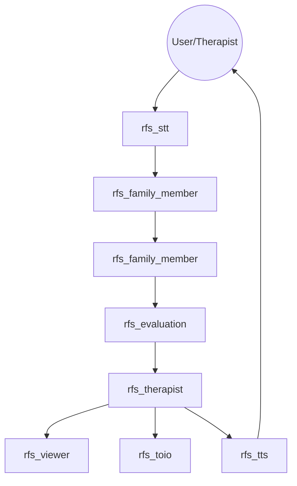

# RFS: Robot Family System

RFS (Robot Family System) is a ROS2-based research and educational simulation platform for family therapy and family psychology. It leverages Multiple LLM-based agents to simulate complex family dynamics, visualizes psychological states on the FACES IV circumplex model, and uses Gradient Descent to suggest therapeutic interventions.

## 🌟 Key Features

- **Multi-Agent Simulation**: Simulates distinct family member personalities (Father, Mother, Daughter, Son) using advanced LLMs.
- **FACES IV Visualization**: Real-time mapping of family dynamics onto Cohesion and Flexibility axes.
- **Dual Trajectory Tracking**: Visualizes both the "Actual Family State" and the "Therapeutic Target" on the same plot.
- **Predictive Interaction**: Implements "Background Scenario Generation" to pre-generate agent responses, significantly reducing latency.
- **Physical Representation**: Integration with [toio™](https://toio.io/) robots for tangible representation of interpersonal distances.
- **Interactive Audio**: Real-time Speech-to-Text (STT) and Text-to-Speech (TTS) capabilities.

## 🏗 System Architecture



## ⚙️ Configuration & Environment

### Environment Variables
The system requires valid API keys for LLM and STT functionalities. Add these to your `.bashrc` or export them in your terminal:

- **`OPENAI_API_KEY`**: Used by `rfs_family` for personality simulation and `rfs_evaluation` for mapping family dynamics.
- **`GEMINI_API_KEY`**: Used by `rfs_stt` for high-performance audio transcription and real-time interaction.

### `config.json` Parameters
Located in `src/rfs_config/config/config.json`, this file controls the behavior and hardware mapping of the simulation.

| Parameter | Type | Description |
| :--- | :--- | :--- |
| **`theme`** | String | The scenario or topic of conversation (e.g., "Christmas", "Moving Out"). |
| **`chat_mode`** | Integer | Interaction logic (0: Normal Sequential, 1: High Velocity/Interventionist). |
| **`family_config`** | List | Active roles in the session (e.g., `["father", "mother", "daughter"]`). |
| **`target_user`** | String | The specific family member the user interacts with primarily via STT. |
| **`turns_per_step`** | Integer | Number of conversation turns before an evaluation trigger. |
| **`w1`, `w2`, `w3`** | Float | Weights for the FACES IV evaluation model (Cohesion, Flexibility, Communication). |
| **`initial_coords`** | Object | Starting (x, y) coordinates on the FACES IV plot. |
| **`move`** | Boolean | Whether toio robots are allowed to move (0: Static, 1: Mobile). |
| **`toio_speaker_match`** | List | Hardware mapping for robots and audio outputs (see below). |

#### Hardware Mapping (`toio_speaker_match`)
Each role must be mapped to a physical toio device and a specific audio sink (speaker):
```json
{
  "role": "father",
  "toio_id": "FA:60:73:56:24:48",
  "speaker_id": "alsa_output.usb-...-stereo"
}
```
*Tip: Use `pactl list short sinks` to find your `speaker_id`.*

## 🚀 Getting Started

### Prerequisites
- **OS**: Ubuntu 24.04 (Noble Numbat)
- **ROS2**: [Jazzy Jalisco](https://docs.ros.org/en/jazzy/Installation.html)
- **Python**: 3.10+
- **Hardware**: toio™ Core Cubes (Optional, if mapping in config).

### Installation
1. **Clone Workspace**:
   ```bash
   git clone https://github.com/robotaichi/rfs.git
   cd rfs
   ```
2. **Setup Directories**:
   ```bash
   mkdir -p src/rfs_database
   ```
3. **Build**:
   ```bash
   colcon build
   source install/setup.bash
   ```

### Running the Simulation
```bash
ros2 launch rfs_bringup rfs_all.launch.py
```

## 📊 FACES IV Model
The system uses the **Family Adaptability and Cohesion Evaluation Scales (FACES IV)**. It tracks:
- **Balanced Cohesion/Flexibility**: The "healthy" center of family dynamics.
- **Unbalanced Scales**: Disengaged, Enmeshed, Rigid, and Chaotic patterns.

The `rfs_therapist` node applies a **Gradient Descent** algorithm to move the family's state from unbalanced quadrants toward the balanced center by adjusting robot behavior prompts.

## 🛠 Advanced Features
- **Background Scenario Generation**: Pre-generates responses while previous robots speak.
- **Sequential Turn Relay**: Ensures only one robot speaks at a time using a lock-mechanism.
- **Robust CSV Parsing**: Robustly handles LLM output for consistent evaluation results.

## 📜 License
This project is licensed under the MIT License - see the [LICENSE](LICENSE) file for details.
