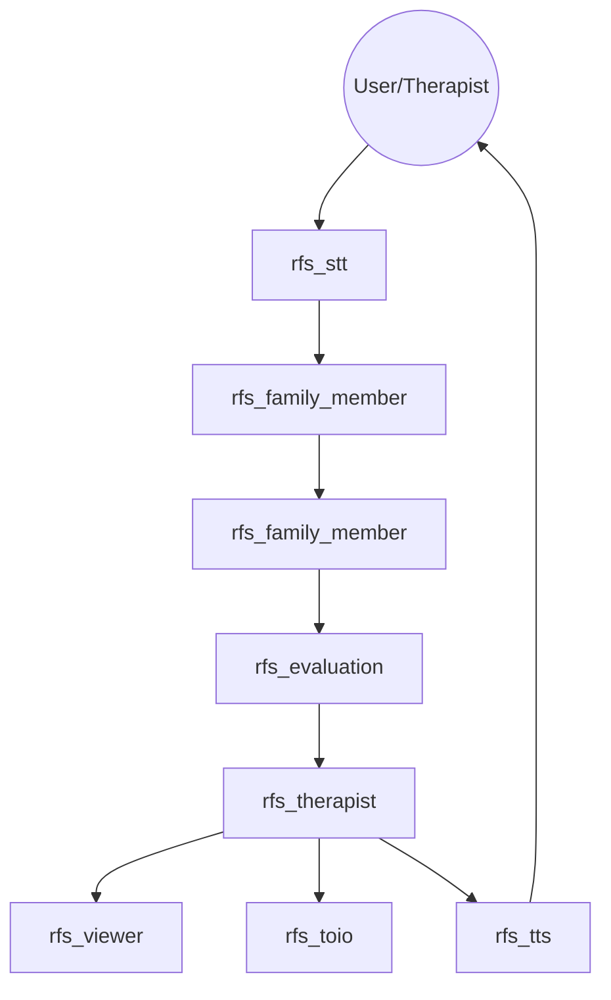

# RFS: Robot Family System

RFS (Robot Family System) is a ROS2-based research and educational simulation platform for family therapy and family psychology. It leverages Multiple LLM-based agents to simulate complex family dynamics, visualizes psychological states on the FACES IV circumplex model, and uses Gradient Descent to suggest therapeutic interventions.

## 🌟 Key Features

- **Multi-Agent Simulation**: Simulates distinct family member personalities (Father, Mother, Daughter, Son) using advanced LLMs.
- **FACES IV Visualization**: Real-time mapping of family dynamics onto Cohesion and Flexibility axes.
- **Dual Trajectory Tracking**: Visualizes both the "Actual Family State" and the "Therapeutic Target" on the same plot.
- **Predictive Interaction**: Implements "Background Scenario Generation" to pre-generate agent responses, significantly reducing latency.
- **Physical Representation**: Integration with [toio™](https://toio.io/) robots for tangible representation of interpersonal distances.
- **Interactive Audio**: Real-time Speech-to-Text (STT) and Text-to-Speech (TTS) capabilities.

## 🏗 System Architecture



### Node Specifications

| Node | Description | Key Topics / Services |
| :--- | :--- | :--- |
| **`rfs_therapist`** | Orchestrates simulation phases and calculates GD-based targets. | `/rfs_faces_plot_updated`, `/rfs_trigger_evaluation` |
| **`rfs_family`** | Handles individual robot logic and LLM personality prompts. | `/rfs_family_actions`, `/rfs_stt_resume` |
| **`rfs_evaluation`** | Maps conversation transcripts to FACES IV metrics. | `/rfs_evaluation_result` |
| **`rfs_viewer`** | GUI for real-time trajectory visualization (Tkinter/Pillow). | `/rfs_faces_plot_updated` |
| **`rfs_tts`** | Text-to-Speech engine utilizing multiple voices. | `TTSService.srv` |
| **`rfs_stt`** | Speech-to-Text engine for user intervention. | `/rfs_stt_result` |

## 🚀 Getting Started

### Prerequisites
- **OS**: Ubuntu 24.04 (Noble Numbat)
- **ROS2**: [Jazzy Jalisco](https://docs.ros.org/en/jazzy/Installation.html)
- **Python**: 3.10+
- **API Key**: `OPENAI_API_KEY` exported in your environment.

### Installation
1. **Clone Workspace**:
   ```bash
   git clone https://github.com/robotaichi/rfs.git
   cd rfs
   ```
2. **Setup Directories**:
   Ensure the data directory exists:
   ```bash
   mkdir -p src/rfs_database
   ```
3. **Build**:
   ```bash
   colcon build
   source install/setup.bash
   ```

### Running the Simulation
Launch all components:
```bash
ros2 launch rfs_bringup rfs_all.launch.py
```

## 📊 FACES IV Model
The system uses the **Family Adaptability and Cohesion Evaluation Scales (FACES IV)**. It tracks:
- **Balanced Cohesion/Flexibility**: The "healthy" center of family dynamics.
- **Unbalanced Scales**: Disengaged, Enmeshed, Rigid, and Chaotic patterns.

The `rfs_therapist` node applies a **Gradient Descent** algorithm to move the family's state from unbalanced quadrants toward the balanced center by adjusting robot behavior prompts.

## 🛠 Advanced Configuration
Modify `src/rfs_config/config/config.json` to change:
- `theme`: The setting of the conversation (e.g., "Family Meeting").
- `family_config`: Which roles are active.
- `chat_mode`: Logic for turn-taking and depth.

## 📜 License
This project is licensed under the MIT License - see the [LICENSE](LICENSE) file for details.
