# RFS: Robot Family System

RFS (Robot Family System) is a ROS2-based research and educational simulation platform for family therapy and family psychology. It leverages Multiple LLM-based agents to simulate complex family dynamics, visualizes psychological states on the FACES IV circumplex model, and uses Gradient Descent to suggest AI-driven therapeutic interventions.

This project is developed as part of the research at the **Fumihide Tanaka Laboratory** at the University of Tsukuba. Our research focuses on the intersection of human-robot interaction, social psychology, and advanced AI to design systems that enhance human well-being and social harmony.

🔗 **Learn more about our research**: [Fumihide Tanaka Laboratory - Projects](https://www.ftl.iit.tsukuba.ac.jp/projects/)

## 🌟 Key Features

- **Multi-Agent Simulation**: Simulates distinct family member personalities (Father, Mother, Daughter, Son) using advanced LLMs.
- **FACES IV Visualization**: Real-time mapping of family dynamics onto Cohesion and Flexibility axes.
- **Dual Trajectory Tracking**: Visualizes both the "Actual Family State" and the "Therapeutic Target" on the same plot.
- **Predictive Interaction**: Implements "Background Scenario Generation" to pre-generate agent responses, significantly reducing latency.
- **Physical Representation**: Integration with [toio™](https://toio.io/) robots for tangible representation of interpersonal distances.
- **Interactive Audio**: Real-time Speech-to-Text (STT) and Text-to-Speech (TTS) capabilities for optional human intervention.

## 🏗 System Architecture & Processing Flow

The system operates in a closed-loop cycle where the **AI Therapist** (`rfs_therapist`) orchestrates agents. The **Human User** can optionally intervene in the family dialogue to influence the simulation.

```mermaid
graph TD
    %% 1. Initialization
    S1[("🟡 STEP START<br/>(AI Therapist: rfs_therapist)")]
    
    %% 2. Interaction
    subgraph Phase2 ["🔄 INTERACTION LOOP (Turns 1-10)"]
        direction TB
        F1["🟢 DIALOGUE GENERATION<br/>(Family Agents)"]
        T1["🔵 SPEECH OUTPUT<br/>(rfs_tts)"]
        
        %% Conditional Interaction
        U_IF{"❓ USER INTERVENTION?"}
        U1(("👤 HUMAN USER<br/>(Intervener)"))
        I1["🔵 VOICE INPUT<br/>(rfs_stt)"]
        
        R1{{"🔄 TURN RELAY"}}
    end
    
    %% 3. Evaluation
    subgraph Phase3 ["📊 EVALUATION & STEERING"]
        direction TB
        E1["🟣 AGGREGATE EVALUATION<br/>(rfs_evaluation)"]
        G1["🟡 GRADIENT DESCENT<br/>(AI Therapist)"]
        P1["🟣 UPDATE PLOT<br/>(rfs_viewer)"]
        M1["🔵 PHYSICAL MOVE<br/>(rfs_toio)"]
    end

    %% Process Connections
    S1 -- "1. Start Turn" --> F1
    F1 -- "2. Voice Request" --> T1
    T1 -- "3. Audio Processed" --> U_IF
    
    %% Branching
    U_IF -- "YES (If Speech Detected)" --> U1
    U1 -- "4. Intervention" --> I1
    I1 -- "5. Update Agent Memory" --> R1
    
    U_IF -. "NO (Default Flow)" .-> R1
    
    R1 -- "6. Next Agent" --> F1
    R1 -- "7. Trigger Assessment" --> E1
    E1 -- "8. FACES IV Score" --> G1
    G1 -- "10. Set Target" --> P1
    G1 -- "11. Robot Steering" --> M1
    M1 -- "12. Step Cycle" --> S1

    %% Node Styling (High Contrast)
    style S1 fill:#FFD700,stroke:#000,stroke-width:3px,color:#000
    style F1 fill:#32CD32,stroke:#000,stroke-width:3px,color:#000
    style T1 fill:#1E90FF,stroke:#000,stroke-width:3px,color:#000
    style U_IF fill:#FFFFFF,stroke:#000,stroke-width:3px,color:#000
    style U1 fill:#FFFFFF,stroke:#000,stroke-width:3px,color:#000
    style I1 fill:#1E90FF,stroke:#000,stroke-width:3px,color:#000
    style R1 fill:#90EE90,stroke:#000,stroke-width:3px,color:#000
    style E1 fill:#9370DB,stroke:#000,stroke-width:3px,color:#000
    style G1 fill:#FFD700,stroke:#000,stroke-width:3px,color:#000
    style P1 fill:#9370DB,stroke:#000,stroke-width:3px,color:#000
    style M1 fill:#1E90FF,stroke:#000,stroke-width:3px,color:#000

    %% Link Styling (Bold & Node-Coordinated)
    linkStyle 0 stroke:#FFD700,stroke-width:4px
    linkStyle 1 stroke:#32CD32,stroke-width:4px
    linkStyle 2 stroke:#1E90FF,stroke-width:4px
    linkStyle 3 stroke:#616161,stroke-width:4px
    linkStyle 4 stroke:#616161,stroke-width:4px
    linkStyle 5 stroke:#1E90FF,stroke-width:4px
    linkStyle 6 stroke:#616161,stroke-width:4px,stroke-dasharray: 5 5
    linkStyle 7 stroke:#32CD32,stroke-width:4px
    linkStyle 8 stroke:#32CD32,stroke-width:4px
    linkStyle 9 stroke:#9370DB,stroke-width:4px
    linkStyle 10 stroke:#FFD700,stroke-width:4px
    linkStyle 11 stroke:#FFD700,stroke-width:4px
    linkStyle 12 stroke:#1E90FF,stroke-width:4px
```



### Detailed Node Responsibilities

| Node | Responsibility | Key Function |
| :--- | :--- | :--- |
| **`rfs_therapist`** | Central Orchestrator | Calculates therapeutic targets using Gradient Descent. |
| **`rfs_family`** | Family Members | Simulates personalities (Father, Mother, etc.) using LLMs. |
| **`rfs_stt`** | Audio Input | Real-time Speech-to-Text for human intervention via Gemini Live. |
| **`rfs_tts`** | Audio Output | Multi-sink synchronized Text-to-Speech for family dialogue. |
| **`rfs_toio`** | Physical Layer | Interpersonal distance representation using [toio™](https://toio.io/) robots. |
| **`rfs_viewer`** | Visualization | Real-time GUI for plotting psychological trajectories. |
| **`rfs_evaluation`** | Map & Assess | Aggregates logs and maps them to the FACES IV circumplex. |

## ⚙️ Configuration & Environment

### Environment Variables
The system requires valid API keys. Set them in your terminal:

```bash
# OpenAI API Key (Required for personality and evaluation)
export OPENAI_API_KEY="sk-..."

# Gemini API Key (Required for real-time STT)
export GEMINI_API_KEY="AIza..."
```

- **`OPENAI_API_KEY`**: Essential for LLM-based dialogue generation and psychological mapping.
- **`GEMINI_API_KEY`**: Required for Gemini Live-based audio transcription.

### `config.json` Specification
Located in `src/rfs_config/config/config.json`.

| Parameter | Type | Description |
| :--- | :--- | :--- |
| **`language`** | String | Language code for interaction: `"en"` (English) or `"ja"` (Japanese). |
| **`theme`** | String | The scenario or topic of conversation (e.g., "Christmas", "Moving Out"). |
| **`chat_mode`** | Integer | Simulation mode: `0` (Normal), `1` (Terminal/LLM Only - no hardware). |
| **`move`** | Integer | Enable toio robot movement: `1` (Enabled), `0` (Disabled). |
| **`target_user`** | String | Name of the person the family is interacting with. |
| **`family_config`** | List | List of active family member roles (e.g., `["father", "mother", "daughter"]`). |
| **`toio_speaker_match`** | List | Hardware mapping for robots (`toio_id`) and audio outputs (`speaker_id`). |
| **`learning_rate_scaling`** | Float | Base multiplier for therapeutic steering sensitivity (Default: `0.25`). |
| **`w1`, `w2`, `w3`** | Float | Weights for the FACES IV evaluation model (Cohesion, Flexibility, Communication). |
| **`turns_per_step`** | Integer | Number of conversation turns before an evaluation trigger. |
| **`vad_aggressiveness`** | Integer | VAD sensitivity (0-3). Higher is more aggressive in filtering noise. |
| **`silence_duration_s`** | Float | Seconds of silence required to end user speech detection. |
| **`speech_trigger_frames`** | Integer | Consecutive frames of speech required to trigger recording. |
| **`vad_debug`** | Boolean | Enable verbose VAD logging for troubleshooting audio issues. |
| **`vad_energy_threshold`** | Float | Minimum RMS energy level to consider a frame as speech. |
| **`llm_model`** | String | Model for family dialogue generation (Default: `"gpt-4o"`). |
| **`llm_temperature`** | Float | Creativity factor for dialogue (Default: `1.0`). |
| **`llm_evaluation_model`** | String | Model for FACES IV self-assessment (Default: `"gpt-4o"`). |
| **`llm_evaluation_temperature`** | Float | Stability factor for assessment (Default: `0.7`). |
| **`initial_coords`** | Object | Starting coordinates `{"x": 8.0, "y": 8.0}` on the Circumplex Model. |
| **`experiment`** | String | Metadata tag for labeling experiment/session trials. |
| **`terminal_mode`** | String | Terminal emulator to use for launching nodes (e.g., `"gnome-terminal"`). |
| **`shutdown_timer_minutes`**| Integer | Automatic shutdown timer. `0` disables it. |

### LLM Selection & Guidance
- **Default Model (`gpt-4o`)**: We use `gpt-4o` as the standard for its exceptional reasoning capabilities and nuanced understanding of human social dynamics. It effectively simulates the complex psychological archetypes required for this research.
- **Temperature Settings**:
  - **Dialogue (`1.0`)**: A higher temperature is used for turn-taking to ensure natural, varied, and creative conversation that reflects the dynamic nature of family interactions.
  - **Evaluation (`0.7`)**: A slightly lower temperature is used for psychological assessment to ensure reliable and consistent scoring while still allowing the LLM to capture the "subjective feel" of the simulated member.

## 🚀 Getting Started

### Prerequisites
- **OS**: Ubuntu 24.04 (Noble Numbat)
- **ROS2**: [Jazzy Jalisco](https://docs.ros.org/en/jazzy/Installation.html)
- **Hardware**: [toio™](https://toio.io/) Core Cubes (Optional).

### Installation
1. **Clone & Build**:
   ```bash
   git clone https://github.com/robotaichi/rfs.git
   cd rfs
   colcon build
   source install/setup.bash
   ```

2. **Launch**:
   ```bash
   ros2 launch rfs_bringup rfs_all.launch.py
   ```

## 📊 FACES IV Model & Gradient Descent

The system treats therapeutic intervention as an optimization problem. If a family state is identified as "Disengaged" or "Enmeshed", the **AI Therapist** calculates the optimal path toward health using **Gradient Descent**.

### Percentile Conversion

Before any mathematical processing or plotting, the system converts the **Raw Scores** obtained from assessments into **Percentile Scores**. This conversion is essential for standardized mapping onto the Circumplex Model and ensures that the Gradient Descent operates on a normalized scale ($0$ to $100$).

The following conversion charts, based on standard FACES IV norms, are used by the system.

#### 1. Balanced & Unbalanced Scales (Cohesion & Flexibility)

| Raw Score | Balanced Percentile (C/F) | Unbalanced Percentile (D/E/R/C) |
| :--- | :--- | :--- |
| **7** | 16 | 10 |
| **8** | 18 | 12 |
| **9** | 20 | 13 |
| **10** | 22 | 14 |
| **11** | 24 | 15 |
| **12** | 25 | 16 |
| **13** | 26 | 18 |
| **14** | 27 | 20 |
| **15** | 28 | 24 |
| **16** | 30 | 26 |
| **17** | 32 | 30 |
| **18** | 35 | 32 |
| **19** | 36 | 34 |
| **20** | 38 | 36 |
| **21** | 40 | 40 |
| **22** | 45 | 45 |
| **23** | 50 | 50 |
| **24** | 55 | 55 |
| **25** | 58 | 60 |
| **26** | 60 | 64 |
| **27** | 62 | 68 |
| **28** | 65 | 70 |
| **29** | 68 | 75 |
| **30** | 70 | 80 |
| **31** | 75 | 85 |
| **32** | 80 | 90 |
| **33** | 82 | 95 |
| **34** | 84 | 98 |
| **35** | 85 | 99 |

#### 2. Family Communication

| Raw Score | Percentile | Raw Score | Percentile |
| :--- | :--- | :--- | :--- |
| **10-23** | 10 | **37** | 58 |
| **24** | 12 | **38** | 62 |
| **25** | 13 | **39** | 65 |
| **26** | 14 | **40** | 70 |
| **27** | 15 | **41** | 74 |
| **28** | 18 | **42** | 80 |
| **29** | 21 | **43** | 83 |
| **30** | 24 | **44** | 86 |
| **31** | 28 | **45** | 88 |
| **32** | 32 | **46** | 90 |
| **33** | 36 | **47** | 94 |
| **34** | 40 | **48** | 96 |
| **35** | 44 | **49** | 97 |
| **36** | 50 | **50** | 99 |

### Ratio Scores

The system also calculates **Ratio Scores** to assess the overall health of the family system. A Ratio Score greater than 1 typically indicates a healthy, balanced system, while a score less than 1 suggests an unbalanced (unhealthy) system.

These are calculated using the converted **Percentile Scores**:

1. **Cohesion Ratio**
> [!NOTE]
> ```math
> \text{Cohesion Ratio} = \frac{C_{bal}}{(C_{dis} + C_{enm}) / 2}
> ```

2. **Flexibility Ratio**
> [!NOTE]
> ```math
> \text{Flexibility Ratio} = \frac{F_{bal}}{(F_{rig} + F_{cha}) / 2}
> ```

3. **Total Ratio**
> [!NOTE]
> ```math
> \text{Total Ratio} = \frac{\text{Cohesion Ratio} + \text{Flexibility Ratio}}{2}
> ```

### Mathematical Foundation

The AI Therapist calculates the optimal therapeutic path using Gradient Descent on the family state vector.

#### 1. State Vector ($x_t$)
The family state at turn $t$ is represented as a 7-dimensional vector consisting of the converted **Percentile Scores**:

> [!NOTE]
> ```math
> x_t = \begin{bmatrix} C_{bal} \\ C_{dis} \\ C_{enm} \\ F_{bal} \\ F_{rig} \\ F_{cha} \\ Comm \end{bmatrix} = [C_{bal}, \dots, Comm]^T
> ```

#### 2. Objective Function ($J(x_t)$)
The goal is to minimize a cost function that balances the FACES IV Ratio (Health) and Centering (Stability):

> [!NOTE]
> ```math
> J(x_t) = \omega_1 \frac{U}{2B} - \omega_2 Comm_t + \frac{\omega_3}{2} \left[ (x - 50)^2 + (y - 50)^2 \right]
> ```
Where:
- $B = C_{bal} + F_{bal}$ (Balanced Sum)
- $U = C_{dis} + C_{enm} + F_{rig} + F_{cha}$ (Unbalanced Sum)

> [!NOTE]
> ```math
> x = C_{bal} + \frac{C_{enm} - C_{dis}}{2}, \quad y = F_{bal} + \frac{F_{cha} - F_{rig}}{2}
> ```

#### 3. Gradient Calculation ($\nabla J(x_t)$)
The gradient vector $\nabla J(x_t)$ represents the direction of steepest increase for the cost function:

> [!NOTE]
> ```math
> \nabla J(x_t) = \left[ \frac{\partial J}{\partial C_{bal}}, \dots, \frac{\partial J}{\partial Comm} \right]^T
> ```

Individual partial derivatives are calculated as follows (combining the Ratio and Centering terms):

> [!NOTE]
> ```math
> \begin{aligned}
> \frac{\partial J}{\partial C_{bal}} &= - \frac{\omega_1 U}{2B^2} + \omega_3(x - 50) \\
> \frac{\partial J}{\partial F_{bal}} &= - \frac{\omega_1 U}{2B^2} + \omega_3(y - 50) \\
> \frac{\partial J}{\partial C_{enm}} &= \frac{\omega_1}{2B} + \frac{\omega_3}{2}(x - 50) \\
> \frac{\partial J}{\partial C_{dis}} &= \frac{\omega_1}{2B} - \frac{\omega_3}{2}(x - 50) \\
> \frac{\partial J}{\partial F_{cha}} &= \frac{\omega_1}{2B} + \frac{\omega_3}{2}(y - 50) \\
> \frac{\partial J}{\partial F_{rig}} &= \frac{\omega_1}{2B} - \frac{\omega_3}{2}(y - 50) \\
> \frac{\partial J}{\partial Comm} &= - \omega_2
> \end{aligned}
> ```

#### 4. Update Rule & Adaptive Learning Rate
The target state is updated iteratively:

> [!NOTE]
> ```math
> x_{t+1} = x_t - \eta(Comm_t) \cdot \nabla J(x_t)
> ```

Where the adaptive learning rate $\eta (Comm_t)$ represents the **step width**:

> [!NOTE]
> ```math
> \eta(Comm_t) = \frac{Comm_t}{100} \cdot 0.25
> ```

Where **0.25** is the base scaling factor (configurable via `learning_rate_scaling` in `config.json`) that determines the overall sensitivity of the therapeutic steering.

*This step width, along with the Communication dimension, acts as the **driving force** for promoting Cohesion and Flexibility.*

The resulting vector adjusts the **Behavioral Steering Prompts** for individual family members, pulling the system towards the **Balanced Center (50, 50)**.

## 📚 References
- **Olson's Circumplex Model**: [Circumplex Model: An Update (Prepare/Enrich)](https://www.prepare-enrich.com/wp-content/uploads/2022/08/Circumplex-Model-An-Update.pdf)
- **FACES IV Manual**: [FACES IV: Manual de Aplicación de Instrumento](https://www.studocu.com/cl/document/universidad-de-valparaiso/trabajo-social-de-familia/faces-iv-manual-aplicacion-de-instrumento/107365427)

## 📜 License
This project is licensed under the MIT License.
