# RFS: Robot Family System

RFS (Robot Family System) is a ROS2-based research and educational simulation platform for family therapy and family psychology. It leverages Multiple LLM-based agents to simulate complex family dynamics, visualizes psychological states on the FACES IV circumplex model, and uses Gradient Descent to suggest therapeutic interventions.

## 🌟 Key Features

- **Multi-Agent Simulation**: Simulates distinct family member personalities (Father, Mother, Daughter, Son) using advanced LLMs.
- **FACES IV Visualization**: Real-time mapping of family dynamics onto Cohesion and Flexibility axes.
- **Dual Trajectory Tracking**: Visualizes both the "Actual Family State" and the "Therapeutic Target" on the same plot.
- **Predictive Interaction**: Implements "Background Scenario Generation" to pre-generate agent responses, significantly reducing latency.
- **Physical Representation**: Integration with [toio™](https://toio.io/) robots for tangible representation of interpersonal distances.
- **Interactive Audio**: Real-time Speech-to-Text (STT) and Text-to-Speech (TTS) capabilities.

## 🏗 System Architecture & Processing Flow

The system operates in a closed-loop cycle consisting of three main phases, with **Family Members** at the center of the interaction.

```mermaid
graph TD
    %% Phase Grouping
    subgraph Initialization ["1. Initialization Phase"]
        Ther_Start["🟡 rfs_therapist (Orchestrator)"]
    end

    subgraph Interaction ["2. Interaction & Background Generation Loop"]
        subgraph FamilyMembers ["Family Agents"]
            Father["🟢 Father"]
            Mother["🟢 Mother"]
            Child["🟢 Child (Daughter/Son)"]
        end
        TTS["🔵 rfs_tts (Audio Out)"]
        STT["🔵 rfs_stt (Voice In)"]
        User(("👤 User (Therapist)"))
        Relay{{"🔄 Turn Relay"}}
    end

    subgraph Evaluation ["3. Evaluation & GD-Steering Phase"]
        Ther_Eval["🟡 rfs_therapist (AGG/GD)"]
        Eval["🟣 rfs_evaluation (Logic)"]
        Plot["🟣 rfs_viewer (Visuals)"]
        Toio["🔹 rfs_toio (Physical)"]
    end

    %% Flow Logic
    Ther_Start -- "<font color='#FBC02D'>Select Leader & StartTurn</font>" --> FamilyMembers
    
    Father -- "<font color='#388E3C'>Request Speech</font>" --> TTS
    Mother -- "<font color='#388E3C'>Request Speech</font>" --> TTS
    Child -- "<font color='#388E3C'>Request Speech</font>" --> TTS
    
    TTS -- "<font color='#01579B'>Audio Output</font>" --> User
    
    FamilyMembers -. "<font color='#388E3C'>[Concurrent] BG Generation</font>" .-> FamilyMembers
    
    User -- "<font color='#616161'>Voice Intervention</font>" --> STT
    STT -- "<font color='#01579B'>Transcription Result</font>" --> FamilyMembers
    
    FamilyMembers -- "<font color='#388E3C'>[Audio End] Trigger Next</font>" --> Relay
    Relay -- "<font color='#388E3C'>Update History & Turn</font>" --> FamilyMembers
    
    Relay -- "<font color='#388E3C'>If Turn >= 10: Trigger Eval</font>" --> Ther_Eval
    
    Ther_Eval -- "<font color='#FBC02D'>Request Self-Eval</font>" --> FamilyMembers
    FamilyMembers -- "<font color='#388E3C'>Member Scoring (CSV)</font>" --> Ther_Eval
    
    Ther_Eval -- "<font color='#FBC02D'>Aggregate Metrics</font>" --> Eval
    Eval -- "<font color='#7B1FA2'>FACES IV Coordinates</font>" --> Ther_Eval
    
    Ther_Eval -- "<font color='#FBC02D'>GD-Target & Plot Update</font>" --> Plot
    Ther_Eval -- "<font color='#FBC02D'>Calculate Distances</font>" --> Toio
    
    Toio -- "<font color='#0097A7'>Finished Move</font>" --> Ther_Eval
    Ther_Eval -- "<font color='#FBC02D'>Start Next Step (S++1)</font>" --> FamilyMembers

    %% Node Styling
    style Ther_Start fill:#FFF9C4,stroke:#FBC02D,stroke-width:2px,color:#000
    style Ther_Eval fill:#FFF9C4,stroke:#FBC02D,stroke-width:2px,color:#000
    style FamilyMembers fill:#E8F5E9,stroke:#388E3C,stroke-width:2px,color:#000
    style Father fill:#C8E6C9,stroke:#388E3C,stroke-width:2px,color:#000
    style Mother fill:#C8E6C9,stroke:#388E3C,stroke-width:2px,color:#000
    style Child fill:#C8E6C9,stroke:#388E3C,stroke-width:2px,color:#000
    style User fill:#F5F5F5,stroke:#9E9E9E,stroke-width:2px,color:#000
    style STT fill:#B3E5FC,stroke:#0288D1,stroke-width:2px,color:#000
    style TTS fill:#B3E5FC,stroke:#0288D1,stroke-width:2px,color:#000
    style Eval fill:#F3E5F5,stroke:#7B1FA2,stroke-width:2px,color:#000
    style Plot fill:#F3E5F5,stroke:#7B1FA2,stroke-width:2px,color:#000
    style Toio fill:#E0F7FA,stroke:#0097A7,stroke-width:2px,color:#000
    style Relay fill:#E8F5E9,stroke:#2E7D32,stroke-width:2px,color:#000

    %% Link Styling (simplified indices after split)
    linkStyle 0 stroke:#FBC02D,stroke-width:2px
    linkStyle 1 stroke:#388E3C,stroke-width:2px
    linkStyle 2 stroke:#388E3C,stroke-width:2px
    linkStyle 3 stroke:#388E3C,stroke-width:2px
    linkStyle 4 stroke:#01579B,stroke-width:2px
    linkStyle 5 stroke:#388E3C,stroke-width:2px,stroke-dasharray: 5 5
    linkStyle 6 stroke:#616161,stroke-width:2px
    linkStyle 7 stroke:#01579B,stroke-width:2px
    linkStyle 8 stroke:#388E3C,stroke-width:2px
    linkStyle 9 stroke:#2E7D32,stroke-width:2px
    linkStyle 10 stroke:#2E7D32,stroke-width:2px
    linkStyle 11 stroke:#FBC02D,stroke-width:2px
    linkStyle 12 stroke:#388E3C,stroke-width:2px
    linkStyle 13 stroke:#FBC02D,stroke-width:2px
    linkStyle 14 stroke:#7B1FA2,stroke-width:2px
    linkStyle 15 stroke:#FBC02D,stroke-width:2px
    linkStyle 16 stroke:#FBC02D,stroke-width:2px
    linkStyle 17 stroke:#0097A7,stroke-width:2px
    linkStyle 18 stroke:#FBC02D,stroke-width:2px
```



### Detailed Node Responsibilities

| Node Category | Description | Primary Processing |
| :--- | :--- | :--- |
| **Orchestrator** (`rfs_therapist`) | The system brain. Manages step-level logic and therapeutic interventions. | Aggregate member evaluations, calculate Cohesion/Flexibility percentiles, and perform Gradient Descent toward balanced center (50, 50). |
| **Agents** (`rfs_family`) | Individual nodes for each family role (Father, Mother, etc.). | LLM-based response generation, turn-taking logic, and individual FACES IV self-scoring. |
| **Sensory/Motor** (`rfs_stt`, `rfs_tts`, `rfs_toio`) | The physical/audio interface layers. | GEMINI-based speech recognition, multi-sink synchronized audio output, and Bluetooth BLE control for toio robots. |
| **Visualization** (`rfs_viewer`, `rfs_evaluation`) | Real-time monitoring and mapping. | Tkinter-based GUI for plotting the circumplex model and background processing of psychological metrics. |

## ⚙️ Configuration & Environment

### Environment Variables
The system requires valid API keys for LLM and STT functionalities.

- **`OPENAI_API_KEY`**: Used by `rfs_family` for personality simulation and `rfs_evaluation` for mapping family dynamics.
- **`GEMINI_API_KEY`**: Used by `rfs_stt` for high-performance audio transcription and real-time interaction.

### `config.json` Specification
Located in `src/rfs_config/config/config.json`.

| Parameter | Type | Description |
| :--- | :--- | :--- |
| **`theme`** | String | The scenario or topic of conversation (e.g., "Christmas", "Moving Out"). |
| **`w1`, `w2`, `w3`** | Float | Weights for the FACES IV evaluation model (Cohesion, Flexibility, Communication). |
| **`turns_per_step`** | Integer | Number of conversation turns before an evaluation trigger. |
| **`toio_speaker_match`** | List | Hardware mapping for robots (`toio_id`) and audio outputs (`speaker_id`). |

## 🚀 Getting Started

### Prerequisites
- **OS**: Ubuntu 24.04 (Noble Numbat)
- **ROS2**: [Jazzy Jalisco](https://docs.ros.org/en/jazzy/Installation.html)
- **Hardware**: toio™ Core Cubes (Optional).

### Installation
1. **Clone & Build**:
   ```bash
   git clone https://github.com/robotaichi/rfs.git
   cd rfs
   mkdir -p src/rfs_database
   colcon build
   source install/setup.bash
   ```

2. **Launch**:
   ```bash
   ros2 launch rfs_bringup rfs_all.launch.py
   ```

## 📊 FACES IV Model & Gradient Descent
The system identifies the family's position on the Cohesion/Flexibility spectrum. If the state is "Disengaged" or "Enmeshed", the `rfs_therapist` calculates a vector toward the **Balanced Center** and adjusts the behavioral "Steering Prompts" for individual family members to encourage healthier interaction patterns.

## 📜 License
This project is licensed under the MIT License.
